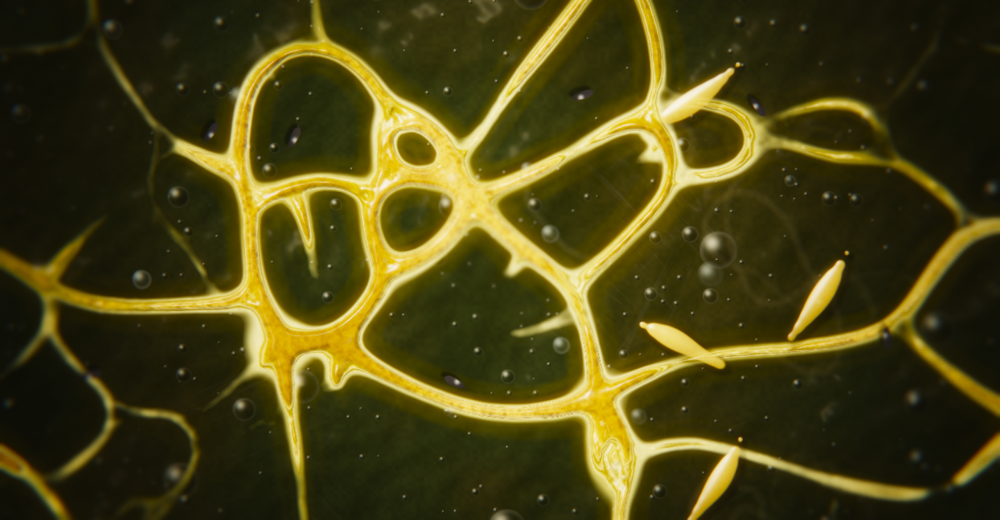
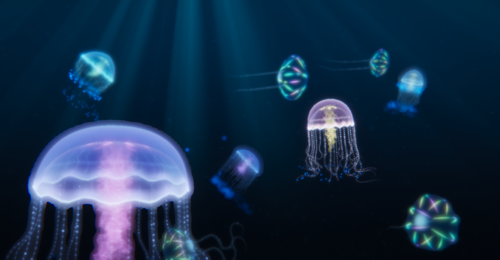
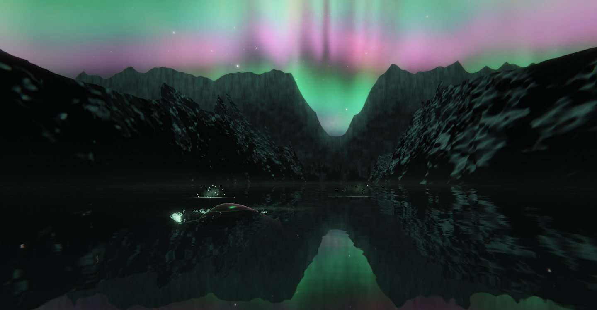
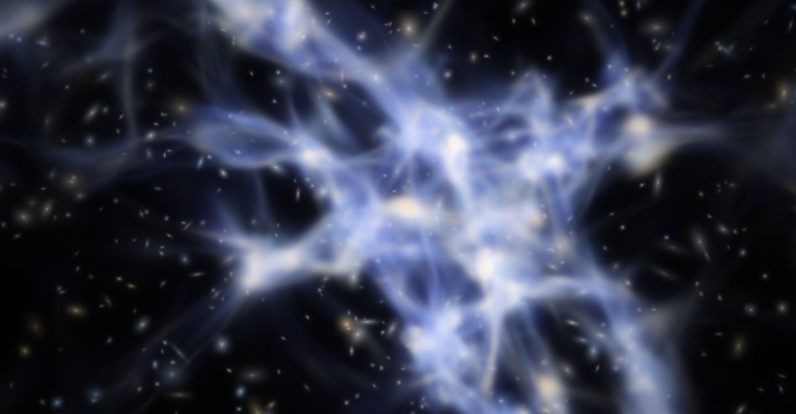

# sonnet-5.5-builds

Projects built in Claude Code sessions.

## deskworlds-windows

A Windows port of [chaseleantj/deskworlds](https://github.com/chaseleantj/deskworlds): live 3D worlds for your desktop that the original only runs as a wallpaper on macOS. The four original scenes are the author's code, unchanged. The new parts are a Windows wallpaper host and four additional worlds (slime mould, pelagic, aurora fjord, cosmic web) written for this port.

- **[Try the eight worlds live in your browser](https://az9713.github.io/sonnet-5.5-builds/)**
- How to run it on a Windows laptop: [`deskworlds-windows/README.md`](deskworlds-windows/README.md)
- How the port was done, step by step: [porting journey](https://az9713.github.io/sonnet-5.5-builds/docs/porting-journey.html) (source: [`deskworlds-windows/docs/porting-journey.html`](deskworlds-windows/docs/porting-journey.html))
- How the worlds are built, layer by layer: [how the worlds work](https://az9713.github.io/sonnet-5.5-builds/docs/how-the-worlds-work.html)

## The eight worlds

Each world is a live 3D scene, rendered in real time with Three.js and WebGL2, that reacts to your cursor. The top four are the original author's; the bottom four are new in this port. **[Try them live in your browser](https://az9713.github.io/sonnet-5.5-builds/)**, no install needed.

| | |
| --- | --- |
|  |  |
| **[Riverbed](https://az9713.github.io/sonnet-5.5-builds/scenes/riverscape/)**: a planted river where a school of neon fish competes for food among rivergrass and driftwood. Click to drop food. | **[Coral reef](https://az9713.github.io/sonnet-5.5-builds/scenes/reefscape/)**: clownfish, anemones, branching corals and cleaner shrimp under shafts of sunlight. Click to feed. |
|  |  |
| **[Betta](https://az9713.github.io/sonnet-5.5-builds/scenes/bettascape/)**: a single halfmoon betta with long flowing fins on black. Drag to look around, scroll to zoom, click to feed. | **[Plasma globe](https://az9713.github.io/sonnet-5.5-builds/scenes/plasmascape/)**: a plasma lamp glowing in a dark room. Move the cursor toward the glass and the discharge reaches for it. |
|  |  |
| **[Slime mould](https://az9713.github.io/sonnet-5.5-builds/scenes/slimescape/)**: a slime mould (Physarum) growing a transport network on a dark agar plate, with oat flakes, slugs and springtails. Move the cursor to shine a lamp: the slime shrinks from the light and slugs crawl toward it. Click to drop an oat flake. | **[Pelagic](https://az9713.github.io/sonnet-5.5-builds/scenes/pelagicscape/)**: jellyfish and comb jellies drifting in dark deep water. Move the cursor through the water and bioluminescent plankton flash blue in its wake. |
|  |  |
| **[Aurora fjord](https://az9713.github.io/sonnet-5.5-builds/scenes/aurorascape/)**: a polar night over a still Arctic fjord. The aurora ripples overhead and in the black water while humpback whales surface, blow and dive. Move the cursor to make ripples; a curious whale may drift over. | **[Cosmic web](https://az9713.github.io/sonnet-5.5-builds/scenes/cosmoscape/)**: the cosmic web of galaxies drifting past in slow time-lapse, flowing into a neural network and then a mycelium. Your cursor is a point mass that bends light and pulls matter. |

Images of the first four are the original author's screenshots from [chaseleantj/deskworlds](https://github.com/chaseleantj/deskworlds). The four newer worlds were written for this port, and their images are frames I rendered with a software WebGL renderer, so they are slower and a little softer than what a GPU shows. The live pages run the same scene code as the Windows wallpaper. In the browser, Space pauses, F goes fullscreen, and there is a Quality menu (Eco 20 fps, Balanced 30 fps, Detail 60 fps).

## How the worlds work

**[Read the live page](https://az9713.github.io/sonnet-5.5-builds/docs/how-the-worlds-work.html)**: the rendering and simulation layers all eight worlds share, then the specific technique behind each one (Riverbed, Coral reef, Betta, Plasma globe, Slime mould, Pelagic, Aurora fjord, Cosmic web), with charts and the real numbers from the code.

GitHub does not allow embedded pages or scripts in a README, so the preview above is an image. Click it to open the live, scrollable page. The source is [`deskworlds-windows/docs/how-the-worlds-work.html`](deskworlds-windows/docs/how-the-worlds-work.html).

## Also in this repo

- [`x_urls_decoded.tsv`](x_urls_decoded.tsv): the X post URLs for the 15 builds, decoded from a video's redirect links.

Original project: [chaseleantj/deskworlds](https://github.com/chaseleantj/deskworlds), MIT licensed. See [`deskworlds-windows/LICENSE`](deskworlds-windows/LICENSE).
