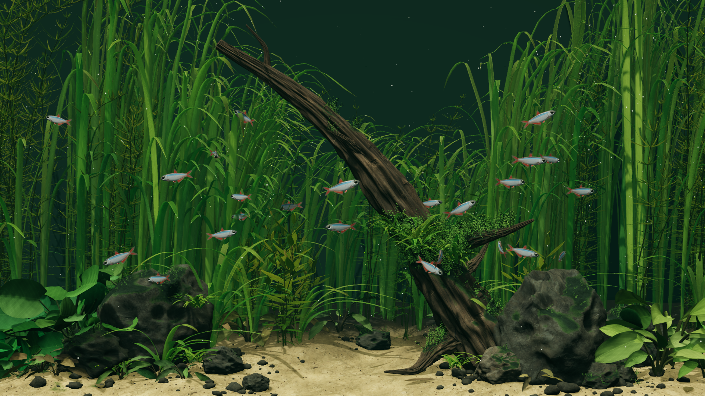
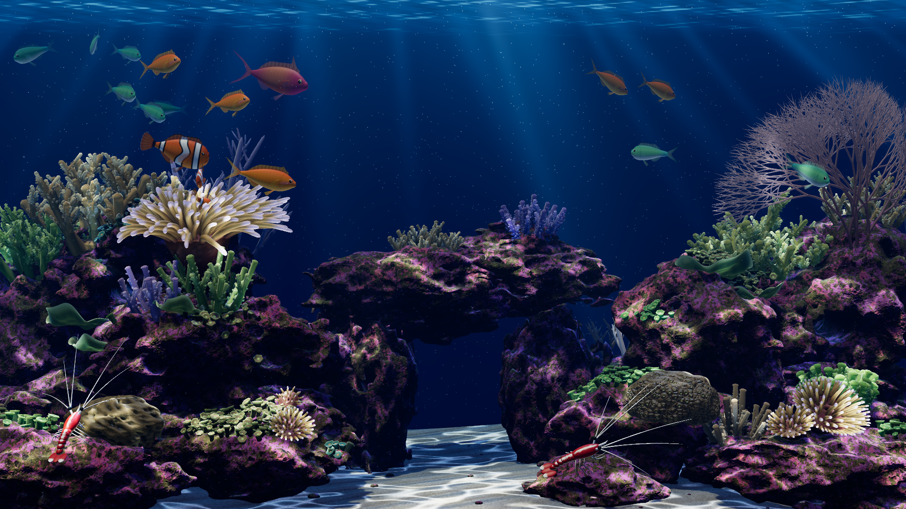
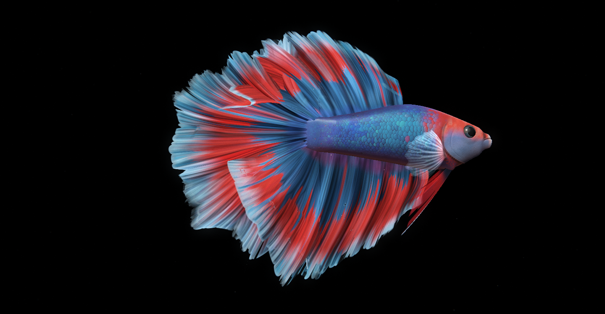
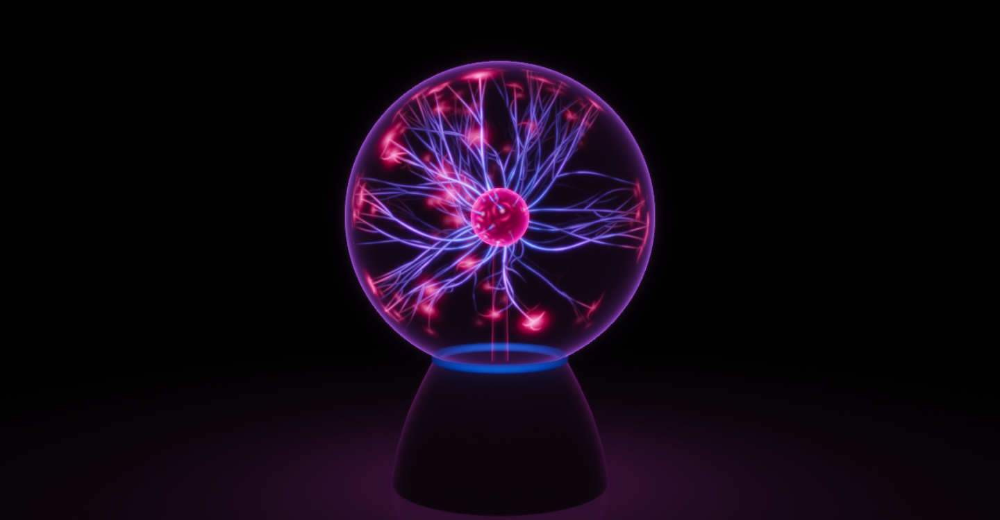
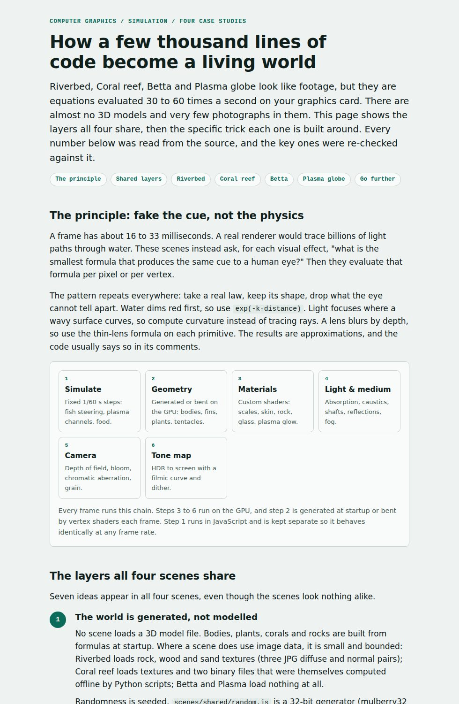

# Deskworlds for Windows

A Windows port of **[chaseleantj/deskworlds](https://github.com/chaseleantj/deskworlds)** (MIT), which puts live 3D worlds on your desktop. The original works as a wallpaper only on macOS. This port adds a Windows host so the same four worlds run on a Windows laptop:

- **Riverbed**, a planted river where a school of fish competes for food
- **Coral reef**, with clownfish and cleaner shrimp
- **Betta**, a single halfmoon betta on black
- **Plasma globe**, a plasma lamp that reaches for your cursor

The scenes are the original author's Three.js code, copied unchanged. Only the part that puts them on the desktop is new. The original README is kept as [`README.upstream.md`](README.upstream.md). To see how the port was done, read the [porting journey](docs/porting-journey.html) (open it in a browser). To see how the worlds themselves are built (shared rendering layers, then the technique behind each scene), read [how the worlds work](docs/how-the-worlds-work.html).

Credit and licence: original project by Chase Lean, MIT (see [`LICENSE`](LICENSE)). Three.js 0.180 is bundled under its MIT licence. Rock, wood and sand textures come from Poly Haven under CC0.

## The four worlds

Each world is a live 3D scene, rendered in real time with Three.js and WebGL2, that reacts to your cursor. **[Try them live in your browser](https://az9713.github.io/sonnet-5.5-builds/)**, no install needed.

| | |
| --- | --- |
| [](https://az9713.github.io/sonnet-5.5-builds/scenes/riverscape/) | [](https://az9713.github.io/sonnet-5.5-builds/scenes/reefscape/) |
| **[Riverbed](https://az9713.github.io/sonnet-5.5-builds/scenes/riverscape/)**: a planted river where a school of neon fish competes for food among rivergrass and driftwood. Click to drop food. | **[Coral reef](https://az9713.github.io/sonnet-5.5-builds/scenes/reefscape/)**: clownfish, anemones, branching corals and cleaner shrimp under shafts of sunlight. Click to feed. |
| [](https://az9713.github.io/sonnet-5.5-builds/scenes/bettascape/) | [](https://az9713.github.io/sonnet-5.5-builds/scenes/plasmascape/) |
| **[Betta](https://az9713.github.io/sonnet-5.5-builds/scenes/bettascape/)**: a single halfmoon betta with long flowing fins on black. Drag to look around, scroll to zoom, click to feed. | **[Plasma globe](https://az9713.github.io/sonnet-5.5-builds/scenes/plasmascape/)**: a plasma lamp glowing in a dark room. Move the cursor toward the glass and the discharge reaches for it. |

Images are the original author's screenshots from [chaseleantj/deskworlds](https://github.com/chaseleantj/deskworlds). The live pages run the same scene code as the Windows wallpaper. In the browser, Space pauses, F goes fullscreen, and there is a Quality menu (Eco 20 fps, Balanced 30 fps, Detail 60 fps).

## How the worlds work

**[Read the live page](https://az9713.github.io/sonnet-5.5-builds/docs/how-the-worlds-work.html)**: the rendering and simulation layers all four worlds share, then the specific technique behind each one (Riverbed, Coral reef, Betta, Plasma globe), with charts and the real numbers from the code.

[](https://az9713.github.io/sonnet-5.5-builds/docs/how-the-worlds-work.html)

GitHub does not allow embedded pages or scripts in a README, so the preview above is an image. Click it to open the live, scrollable page. The source is [`deskworlds-windows/docs/how-the-worlds-work.html`](docs/how-the-worlds-work.html).

## Get it running on your Windows laptop

There are three ways, from quickest to most complete. Start with A: it needs no build and shows you a scene within a couple of minutes.

You will need Windows 10 (version 1809 or newer) or Windows 11, and a GPU with WebGL2, which any laptop from the last several years has.

### A. See the worlds in your browser (2 minutes)

1. Install Node.js 20 or newer. In a terminal: `winget install OpenJS.NodeJS.LTS`, or download it from <https://nodejs.org>. Open a new terminal afterwards.
2. Get the code. With Git:
   ```bat
   git clone -b claude/youthful-clarke-u54bhy https://github.com/az9713/sonnet-5.5-builds
   cd sonnet-5.5-builds\deskworlds-windows
   ```
   Without Git, open the branch on GitHub, choose **Code > Download ZIP**, unzip it, and open a terminal in the `deskworlds-windows` folder. (Once this branch is merged, drop the `-b ...` part.)
3. Start it:
   ```bat
   windows\run-browser.cmd
   ```
   This starts a small local server and opens <http://127.0.0.1:8080> in your browser. `npm start` does the same without opening the browser. If port 8080 is busy, run `set PORT=8081` first.
4. Click a scene to open it. Move the mouse to make the creatures react; click to drop food. Press **Space** to pause, **F** for fullscreen. Stop the server with Ctrl+C.

Do not double-click `index.html`. The scenes load as modules and need the local server.

### B. Run it as your desktop wallpaper, prebuilt (about 5 minutes)

This runs the real wallpaper host without installing a compiler.

1. On GitHub, open the repo's **Actions** tab, choose the **deskworlds-windows** workflow, open the latest run with a green tick, and download the **Deskworlds-win-x64** artifact at the bottom (you need to be signed in to GitHub). Artifacts are kept for 90 days.
2. Unzip it to a folder you will keep, for example `C:\Users\<you>\Deskworlds`. Keep the `scene` folder next to `Deskworlds.exe`.
3. Try it in a normal window first:
   ```bat
   Deskworlds.exe --window
   ```
   Windows SmartScreen may warn that the app is unrecognised, because it is not code-signed. Choose **More info > Run anyway** if you trust it.
4. If the scene draws in that window, quit it from the tray icon and run `Deskworlds.exe` with no flag. The world now appears behind your desktop icons, on every monitor.

It needs the Microsoft Edge WebView2 Runtime. Windows 11 and up-to-date Windows 10 already have it. If Deskworlds says it is missing, install it from <https://developer.microsoft.com/microsoft-edge/webview2/>.

### C. Build and install from source (10 minutes)

This is the installer route, the equivalent of the original's `sh wallpaper/install.sh` on a Mac.

1. Install the .NET 8 SDK: `winget install Microsoft.DotNet.SDK.8`. Open a new terminal.
2. Get the code as in step A2, then from the `deskworlds-windows` folder run:
   ```bat
   npm run wallpaper
   ```
   or, without Node, `powershell -ExecutionPolicy Bypass -File windows\install.ps1`.
3. The script builds the app for your CPU (x64 or ARM64), installs it to `%LOCALAPPDATA%\Programs\Deskworlds`, adds a sign-in entry so it starts with Windows, and launches it. Pass `-NoAutostart` to skip the sign-in entry.
4. To remove it: `npm run unwallpaper`. Your normal desktop picture is never changed.

## Using it

Click the Deskworlds icon in the taskbar tray (click the `^` arrow if it is hidden):

- **World** switches every monitor between the four scenes. The choice is remembered.
- **Feed** drops food on every monitor (Riverbed, Coral reef, Betta). Clicking the desktop does not feed; use the menu.
- **Pause / Resume** stops or restarts the animation and is remembered. If Windows animations are turned off, it starts paused.
- **Start with Windows** toggles the sign-in entry.
- **Quit** closes it.

Desktop icons, right-click menus and dragging keep working, because the world sits behind the icons and never takes mouse input. The app reads the cursor position so the creatures still notice you.

To save power it draws less when it can. On mains power it runs at up to 60 fps at your full screen resolution. On battery it runs at up to 30 fps at lower resolution. It drops to 20 fps when windows cover most of the desktop, and stops when the desktop is almost fully covered, on Battery Saver, when the session is locked, and when the display is off. Each monitor runs its own scene, so more monitors use more power.

Nothing leaves your computer. There is no account, analytics or network access after setup.

## If something goes wrong

| Symptom | Try |
| --- | --- |
| Browser shows a blank page or module errors | You opened the file directly. Use `windows\run-browser.cmd` or `npm start`. |
| `node` or `npm` is not recognised | Open a new terminal after installing Node.js, or run `winget install OpenJS.NodeJS.LTS`. |
| Scene shows but stays black | Update your graphics driver. Check <https://get.webgl.org/webgl2/> in the same browser. |
| Message about WebView2 | Install the WebView2 Runtime (link above). |
| Wallpaper appears as a normal window, or not at all | Run with `--window` to confirm the scene itself works, then read `%LOCALAPPDATA%\Deskworlds\deskworlds.log` and open an issue with your Windows version (Win + R, `winver`). |
| Wallpaper is frozen | Open the tray menu; the top line says why (paused, Battery Saver, covered, locked). |
| `npm run wallpaper` says the .NET SDK is missing | Install it (step C1) and open a new terminal. |

Command-line options for `Deskworlds.exe`: `--window` shows a normal window instead of drawing behind the icons, and `--world plasmascape` (or `riverscape`, `reefscape`, `bettascape`) picks a scene for that run. Set `DESKWORLDS_DEVTOOLS=1` to enable F12. The log is `%LOCALAPPDATA%\Deskworlds\deskworlds.log`.

## What is verified and what is not

- The scene syntax check and the full scene test suite pass on Linux (Node 22) and in GitHub Actions on `windows-latest`.
- The C# host builds in GitHub Actions on `windows-latest` and produces the `Deskworlds-win-x64` artifact.
- **Not yet confirmed on a physical Windows laptop:** that the world attaches behind the desktop icons, behaviour on monitors with different display scaling, and frame rate on your GPU. The attachment method relies on undocumented Explorer behaviour that has differed between Windows builds. Path A always works; use `--window` in path B to separate a scene problem from an attachment problem.

## How the port is built

The macOS app is a single Swift file (656 lines) that hosts a web view. The scenes are about 13,800 lines of JavaScript that run unchanged in any WebGL2 browser. So the port replaces only the host:

| macOS (original) | Windows (this port) |
| --- | --- |
| Borderless `NSWindow` at desktop level | Borderless form parented to Explorer's `WorkerW` / `Progman` window |
| `WKWebView` and a `deskworlds://` scheme handler | WebView2 with a virtual host mapping to the `scene` folder |
| `webkit.messageHandlers.ready` | A small injected shim onto `chrome.webview.postMessage` |
| `NSEvent.mouseLocation` polled | `GetCursorPos` polled, converted using the monitor's DPI |
| `CGWindowListCopyWindowInfo` for coverage | `EnumWindows` with DWM frame bounds |
| IOKit battery and Low Power Mode | `GetSystemPowerStatus` (mains, Battery Saver) |
| Sleep and lock notifications | Display-state power notification, `SessionSwitch`, `PowerModeChanged` |
| Menu bar item | Tray `NotifyIcon` |
| `launchctl` login item | `HKCU\...\Run` registry entry |

Other Windows fixes: `npm run check` used a POSIX shell loop and is now `tools/check.mjs`; the installer is PowerShell; `tools/bake-live-rock.py` reads its input as UTF-8. Rebuilding the reef's baked meshes (`tools/bake-*.py`) needs Python with numpy, scipy, scikit-image and Pillow, and is only needed if you change the reef layout.

Source layout: `windows/Deskworlds/` (C# host), `windows/install.ps1`, `windows/uninstall.ps1`, `windows/run-browser.cmd`, `scenes/`, `vendor/`, `ui/`.
